# CamperControl Transit Horizon für Venus OS

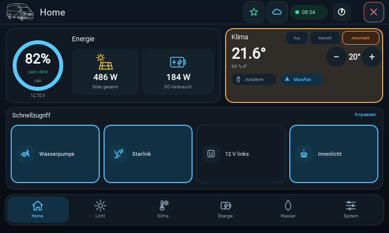

CamperControl Transit Horizon ist eine für Camper ausgebaute Variante von
[Victron Energy gui-v2](https://github.com/victronenergy/gui-v2). Sie läuft
nativ auf dem GX Touch und als WebAssembly-Oberfläche in der Victron Remote
Console. Der Cerbo verwaltet Zustände, Einstellungen, Wetter und Tide zentral;
GX/WASM, Ford SYNC und Node-RED verwenden dieselben Daten- und Bedienverträge.

> **This code is based on Victron Energy code.** Dieses Repository ist derzeit
> technisch aus Victrons Historie abgeleitet, wird von GitHub aber nicht als
> formaler Fork geführt. Es ist kein offizielles Produkt von Victron Energy.

[Funktionen](#funktionen) · [Galerie](#interaktive-galerie) ·
[Victron-Rückkehr](#victron-bleibt-im-hintergrund-aktiv) ·
[Wetter & Tide](#wetter-und-tide) · [Architektur](#architektur-und-sicherheit) ·
[Bauen & testen](#bauen-und-testen) · [Lizenz](#lizenz)

## Funktionen

| Bereich | Funktionen |
| --- | --- |
| Home | Batterie-SOC, Spannung, Lade-/Entladerichtung, Restlaufzeit, Solar, DC-Verbrauch, Klima und vier frei wählbare Schnellzugriffe |
| Licht | Fahrer-/Beifahrerseite, visuelle Leuchtenpositionen, Dimmer, Fernlicht und konfigurierbare Camping-/Nacht-/Aus-Szenen |
| Klima | Komfortregelung mit Aus/Manuell/Automatik, Solltemperatur, Autoterm-Heizung und MaxxFan |
| Energie | 12-V-Ausgänge, Wasserpumpe, Starlink, MaxxFan, 230 V, Batterie, einzelne MPPT-Regler, Orion XS und INDEVOLT getrennt |
| Wasser | Frischwasserstand und Wasserpumpe mit klarer Verfügbarkeitsanzeige |
| System | Verbindungsstatus, CamperControl-Informationen, originale Victron-Einstellungen und Rückkehr zur Victron-Ansicht |
| Seitenpanels | Cerbo-Favoriten links sowie DWD-Wetter und BSH-Tide rechts; erreichbar über Kopfzeile oder Randgeste |

Die Oberfläche ist auf das logische 800×480-Raster des GX Touch 50 ausgelegt
und skaliert in der WASM Remote Console ohne schwarze Restflächen. Tag- und
Nachtmodus sowie Bediengeometrie werden gemeinsam gepflegt. GX/WASM ist die
Designreferenz für Ford SYNC und Node-RED.

## Victron bleibt im Hintergrund aktiv

CamperControl ersetzt die originale Victron-Bedienung nicht. Die Victron-Seiten
und -Einstellungen bleiben im selben `gui-v2`-Prozess geladen; CamperControl ist
eine zusätzliche Oberfläche darüber. Der sichtbare Schließen-/Zurück-Schalter
oben rechts sowie „Victron öffnen“ auf der Systemseite führen jederzeit wieder
zur normalen Victron-Ansicht. Dadurch bleiben auch alle nicht von CamperControl
abgedeckten Victron-Funktionen erreichbar. In der originalen Victron-Ansicht
führt der Schalter „CAMPER“ oben zurück zu CamperControl.

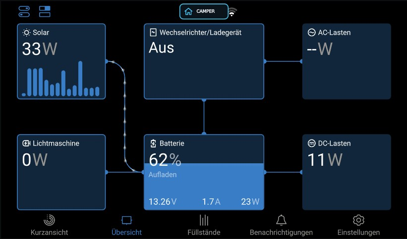

## Interaktive Galerie

Die Bereiche lassen sich auf GitHub einzeln auf- und zuklappen. Alle Bilder
werden direkt aus dem lokalen Qt-6-Preview des jeweiligen QML-Stands in
800×480 erzeugt.

<details open>
<summary><strong>Home</strong></summary>


</details>

<details>
<summary><strong>Licht – Fahrer- und Beifahrerseite</strong></summary>

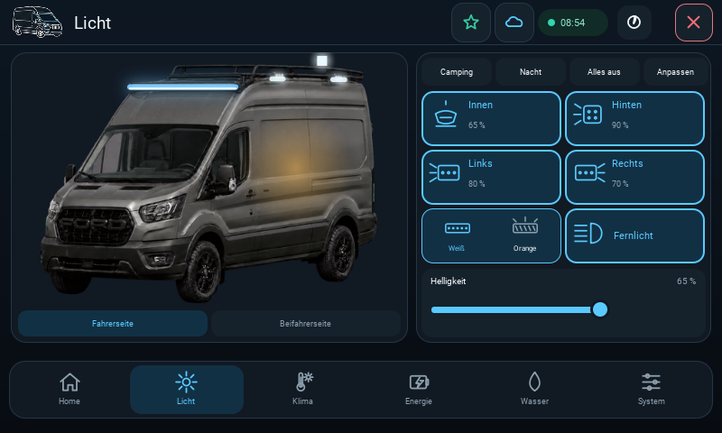

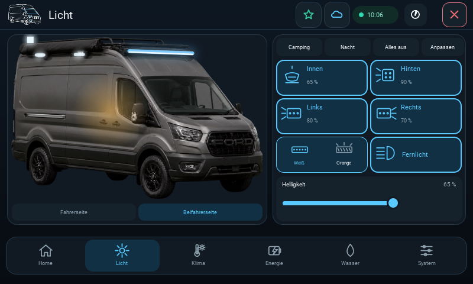

</details>

<details>
<summary><strong>Klima</strong></summary>

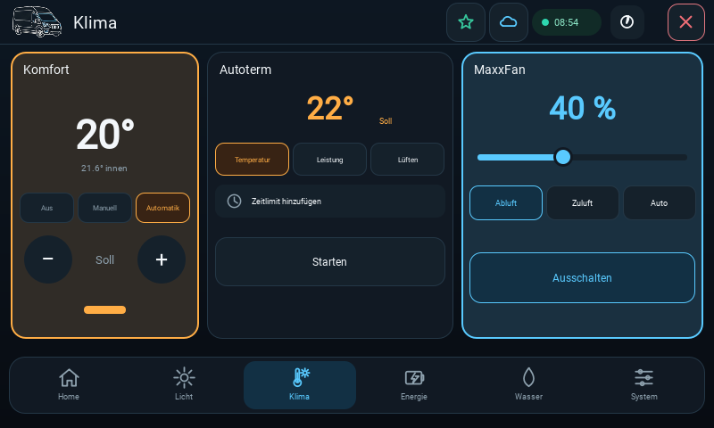

</details>

<details>
<summary><strong>Energie – Verbraucher und Quellen</strong></summary>

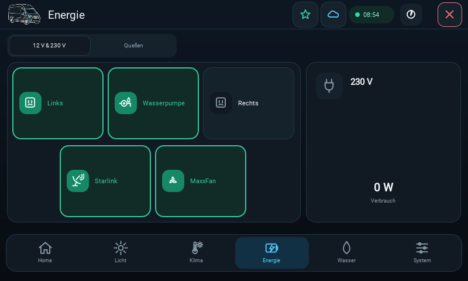

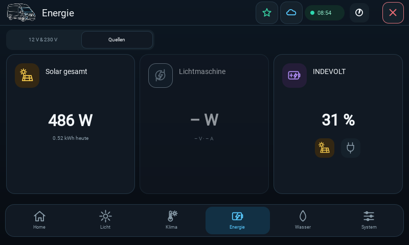

</details>

<details>
<summary><strong>Wasser</strong></summary>

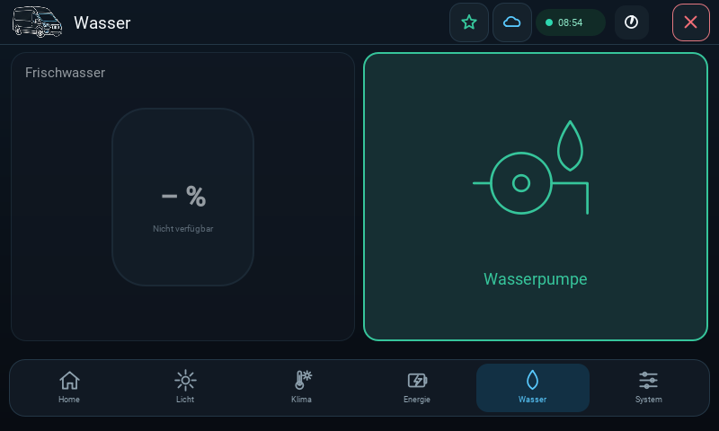

</details>

<details>
<summary><strong>System</strong></summary>

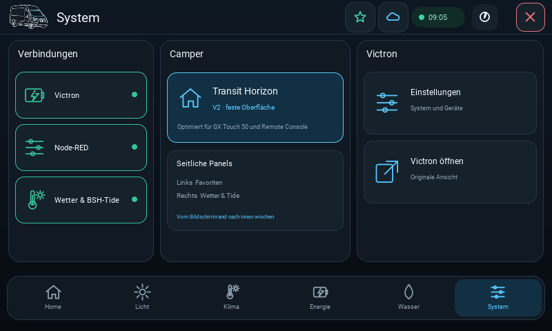

</details>

<details>
<summary><strong>Favoritenpanel</strong></summary>

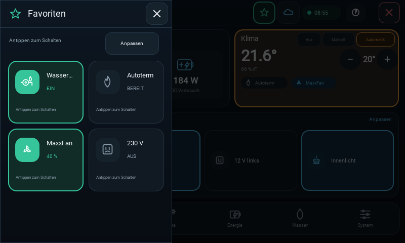

</details>

<details>
<summary><strong>Wetter- und Tidepanel</strong></summary>

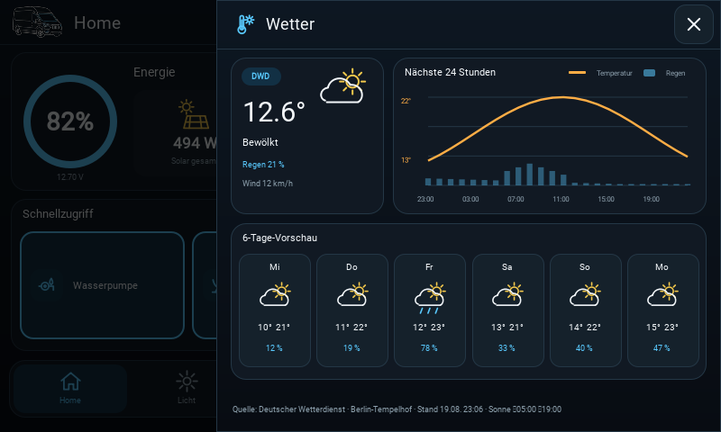

</details>

## Wetter und Tide

Wetter und Tide besitzen getrennte Standortentscheidungen:

- **Wetter:** standardmäßig GPS/automatisch, optional eine feste validierte
  DWD-Wetterstation.
- **Tide:** standardmäßig GPS/automatisch, optional eine feste validierte
  BSH-Nordseestation.
- Die automatische Tidesuche berücksichtigt nur echte BSH-Punktstationen mit
  `region = north_sea` und gültiger CC-BY-4.0-Metadatenangabe.
- Die 60 km begrenzen nur die Suche nach einer nahen Station. Ohne GPS oder
  ohne nahe Meeresstation bleibt Tide sichtbar und fällt auf „Wilhelmshaven
  Alter Vorhafen“ zurück.
- Binnengewässer-, Binnenschifffahrts- und Binnenpegelstationen werden nicht
  angeboten oder angezeigt.

Der Cerbo lädt und normalisiert bis zu 48 Stunden DWD-MOSMIX-Daten, sechs Tage
Vorschau und die BSH-Tidekurve. Im Panel werden die nächsten 24 Stunden
gemeinsam für Temperatur, Regen und Tide dargestellt. Bei Netzausfall darf nur
ein gültiger, zur ausgewählten Station passender Cache weiterverwendet werden.
GPS-Koordinaten werden weder persistiert noch geloggt.

## Architektur und Sicherheit

| Komponente | Aufgabe und Datenweg |
| --- | --- |
| Cerbo | Zentrale Datenhaltung, Validierung, Einstellungen, DWD-/BSH-Abruf und Cache |
| GX | Lokale Qt-6-Oberfläche über D-Bus |
| WASM | Remote Console über den vorhandenen MQTT-Datenweg |
| Ford SYNC | Liest denselben normalisierten CamperControl-Zustand und sendet nur validierte Bedienabsichten |
| Node-RED | Liest denselben Zustand, stellt dieselben Seiten bereit und delegiert zentrale Änderungen an den Cerbo |

Die QML-Oberfläche führt keine eigenen HTTP-Wetterabrufe aus. Schreibzugriffe
sind geändert-nur, größenbegrenzt und validiert. Remote-Schalten und
Einstellungsänderungen bleiben ohne vollständige VRM-Berechtigung gesperrt;
reine Anzeige funktioniert weiterhin.

## Bauen und testen

Der produktive Build verwendet Qt 6.8.3 für GX und WASM. Vor jedem Paketbuild
müssen der exakte Commit, ein sauberer Worktree, alle CamperControl-Verträge
und der echte 800×480-Touch-Smoke-Test geprüft werden:

```powershell
$env:PYTHONPATH = (Resolve-Path '.deps\pyside6').Path
$python = 'C:\Users\wehla\.cache\codex-runtimes\codex-primary-runtime\dependencies\python\python.exe'
& $python -m unittest discover -s tests -p 'camper_*_contract.py'
& $python tools\camper-preview\smoke_test.py
```

Die vollständige reproduzierbare Build-, Hash-, Paket- und
Deployment-Reihenfolge steht in [BUILD_DEPLOY.md](BUILD_DEPLOY.md). Ein
Deployment auf Cerbo/GX/WASM erfolgt erst nach vollständiger lokaler Prüfung
und ausdrücklicher Freigabe.

## Upstream

Victron Energy entwickelt `gui-v2` für Venus OS, GX Touch und Remote Console.
Die ursprüngliche Dokumentation und das Upstream-Projekt sind unter
[victronenergy/gui-v2](https://github.com/victronenergy/gui-v2) verfügbar. Für
lokale Upstream-Synchronisierung sollte dieser Ursprung als separater
`upstream`-Remote geführt werden; der CamperControl-Remote bleibt davon
getrennt.

## Lizenz

Die Lizenzierung ist bewusst getrennt:

- Der von Victron Energy übernommene Code und Änderungen daran bleiben unter
  der [Victron Energy OS license v1](LICENSE.txt). Deren Bedingungen gelten
  unverändert, einschließlich der Beschränkung auf Systeme, deren Kern aus
  Victron-Energy-Komponenten besteht.
- Eigenständige CamperControl-Komponenten, Dokumentation und Assets stehen,
  soweit Slinghorse-Ship die Rechte daran hält, unter der
  [PolyForm Noncommercial License 1.0.0](LICENSE-CAMPERCONTROL.md).
  Kommerzielle Nutzung dieser CamperControl-Anteile ist nicht erlaubt.
- Die genaue Zuordnung und Hinweise zu Drittmaterial stehen in
  [NOTICE.md](NOTICE.md).
- DWD- und BSH-Daten bleiben separat unter CC BY 4.0; Quellenangaben und
  Verarbeitungshinweise stehen in [DATA-LICENSES.md](DATA-LICENSES.md).

Marken, Produktnamen und Drittmaterial werden durch die CamperControl-Lizenz
nicht mitlizenziert.
